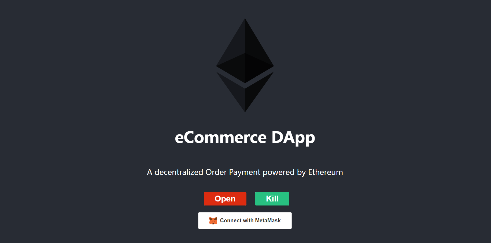
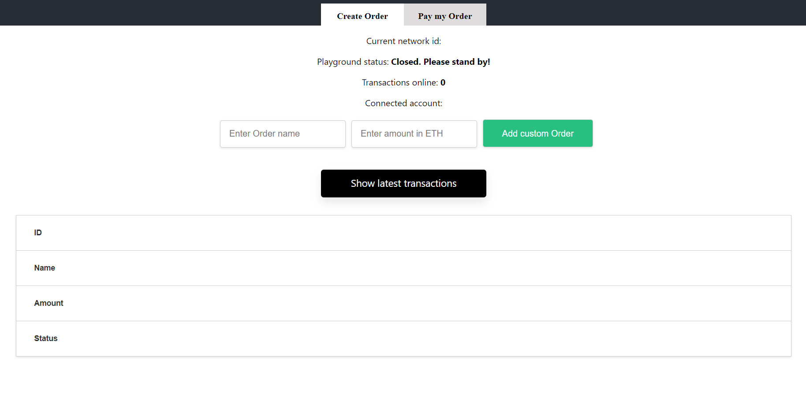

# Decentralized Order Payment Platform on Ethereum
Ordinary:
This project aims to simulate basic functionalities of a decentralized marketplace application powered by the Ethereum blockchain. 
The DApp focuses on initial Seller and Buyer actions as well as the transfer of funds between them. Admin functions are included for demonstrative purposes, which get in the way of pure decentralization.
New:
I redesigning the front-end to better accommodate a decentralized Order Payment platform that allows Users to Add and Pay orders by Eth.
This new version 
This project seeks to emulate the essential features of an Ethereum blockchain-based decentralized order payment system.
For the company and the client, this DApp focuses on actions related to creating and paying orders. For demonstration reasons, administrative tasks are included, which obstructs true decentralization.

## Demo screens

## Technology

- Smart contracts for business logic (adding products, buying products, transfer of funds) written in Solidity
- Front-end developed using a reactive UI framework with the integration of ReactJS
- Truffle development framework for Ethereum

## Implementation

## Design

[Figma](https://www.figma.com/community/file/1125969377350002819)

### Prerequisites

- Node v10.19.0
- Solidity v0.6.12 (solc-js)
- Truffle v5.1.46

### Setup
- Clone the repo using `git clone https://github.com/QuynhNgocNhi/eCommerceDapp`
- Have a local blockchain running on port 7545 (e.g. using Ganache)
- From the project folder, deploy contracts with `truffle migrate --reset`

### Unit Tests
- You can run the tests by running truffle test from the Marketplace directory
- Note that there are tests both in JavaScript and Solidity

### To run the client:
- Navigate to the client folder with `cd client`
- Run `npm install` and then `npm run start`
- Your browser should open and run the project (otherwise go to localhost:3000)
- Connect your metamask (auto open metamask for you when start) every time you changes account or it will have error after then
- You must changes your network into Rospten testnet
- User as Seller will create order(create order, wait for transaction created and then confirm transaction, it takes about 1 minute to pending after you confirm)
- User as Buyer will pay for Seller's Order by id of that order
- Only User as Contract Owner can pause or kill the contract(when it is paused, user cannot create any transaction)
- thats all.
Thankyou for watching.
### Contract interaction on a local blockchain
- Ensure your browser has a plugin (e.g. Metamask) that allows you to interact with the Ethereum blockchain
- Ensure you have a local blockchain running (e.g. on Ganache)
- Select Localhost:8545 or Custom RPC depending on which port your Ganache blockchain is running on
- Interact with the web interface

### Contract interaction on Ropsten Testnet
- Ensure your browser has a plugin (e.g. Metamask) that allows you to interact with the Ethereum blockchain
- Select Ropsten Test Network and choose a Metamask account that has some testnet ether. You can obtain some Ropsten testnet ether via this faucet: https://faucet.ropsten.mudit.blog/
- Interact with the web interface
